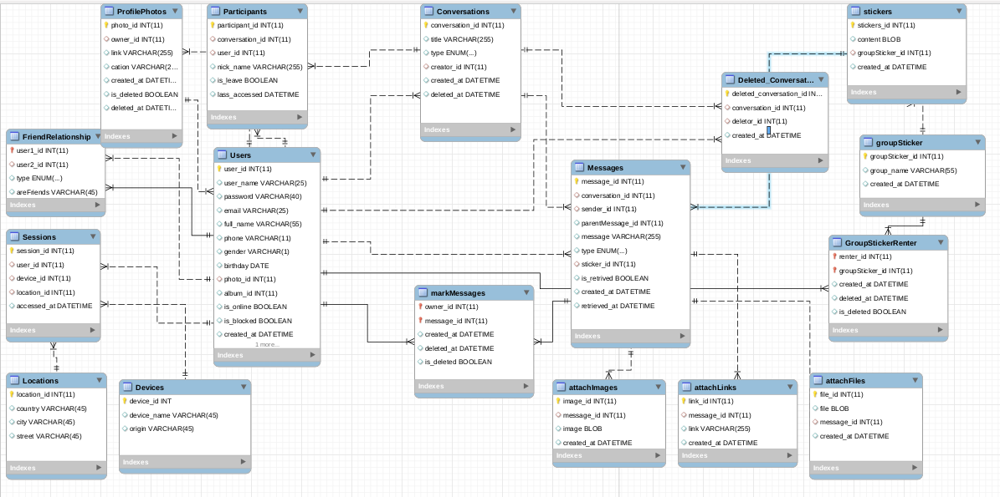

### Mục lục
[I. Yêu cầu ứng dụng](#I.-Yêu-cầu-ứng-dụng)

[II. Thiết kế cơ sở dữ liệu cho ứng dụng](#II.-Thiết-kế-cơ-sở-dữ-liệu-cho-ứng-dụng)

[III. Truy vấn dữ liệu](#iii-truy-vấn-dữ-liệu)

### I. Yêu cầu ứng dụng
Thiết kế schema cho chương trình chat - trò chuyện (với Redis và với MySQL), sử dụng Python để tương tác.

Mô tả chương trình chat: cơ chế tương tự Zalo, Message. 
### 1.1. Cơ bản:

- Tạo tài khoản (username/password, email,...)
- Chọn người trò chuyện (theo username hoặc email)
- Hiển thị lịch sử trò chuyện (nếu có)
- Trò chuyện (chat)

### 1.2. Nâng cao:

- Kết bạn
- Chat trong nhóm
- Hiển thị trạng thái online/offline của người khác
- Hiện thị trạng thái tin nhắn (seen)

### 1.3. Hướng dẫn 

- Thiết kế hệ thống tài khoản 
- Thiết kế cấu trúc lưu trữ lịch sử chat
- Thiết kế cấu trúc lưu trữ nội dung tin nhắn 

### II. Thiết kế cơ sở dữ liệu cho ứng dụng

#### 2.1 Mô hình cơ sở dữ liệu

Bảng Users

Mô tả: chứa thuộc tính của người dùng

| **Thuộc tính** | **Kiểu dữ liệu** |   **Diễn giải**   |
|:----------:|--------------|:-------------:|
| user_id    | int(11)          |    Mã user    |
| user_name  | varchar(25)  | Tên đăng nhập |
| password   | varchar(40)  | Mật khẩu      |
| email      | varchar(25)  | Địa chỉ mail  | 
| full_name  | varchar(55)  | Tên đầy đủ    |
| phone      | varchar(11)  | Số điện thoại |
| gender     | varchar(1)   | Giới tính     |
| birthday   | Date         | Ngày sinh     |
| photo_id| int(11) | Mã ảnh đại diện  |
| album_id | int(11) | Mã album |
| is_online  | boolean      | Trạng thái online |
| is_blocked | boolean      | Trạng thái block |
| created_at | DateTime     | Thời điểm tạo |

Bảng ProfilePhotos
Mô tả: Chứa thông tin về ảnh đại diện của user

| **Thuộc tính** | **Kiểu dữ liệu** |   **Diễn giải**   |
|:----------:|--------------|:-------------:|
| photo_id   | int(11)      | Mã photo |
| owner_id   | int(11)      | Mã user sở hữu id |
| link       | BLOB  | Nội dung ảnh |
| cation     | text | Phụ đề cho ảnh   |
| created_at | DateTime     | Thời điểm tạo    |
| is_deleted | boolean      | Bị xóa hay chưa  |
| deleted at | DateTime | Thời điểm xóa |

 
Bảng FriendRelationship

Mô tả: chứa thuộc tính của người dùng

| **Thuộc tính** | **Kiểu dữ liệu** |   **Diễn giải**   |
|:----------:|--------------|:-------------:|
| user1_id   | int(11)      | Mã người dùng 1|
| user2_id   | int(11)      | Mã người dùng 2|
| type       | enum         | Mối quan hệ    |
| areFriends | boolean      | Có phải bạn bè  hay không |

Bảng Conversations

Mô tả: chứa thông về cuộc trò chuyện

| **Thuộc tính** | **Kiểu dữ liệu** |   **Diễn giải**   |
|:----------:|--------------|:-------------:|
| conversation_id | int(11) | Mã cuộc trò chuyện |
| title           | varchar(255) | Tên cuộc trò chuyện |
| created_at      | DateTime    | Thời gian tạo cuộc trò chuyện |
| type            | enum        | Loại trò chuyện |
| creator_id      | int(11)     | Id user tạo cuộc trò chuyện |
| deleted_at      | DateTime    | Thời điểm xóa cuộc trò chuyện |

Bảng attachLinks

Mô tả: chứa đương dẫn được đính kèm trong message

| **Thuộc tính** | **Kiểu dữ liệu** |   **Diễn giải**   |
|:----------:|--------------|:-------------:|
| link_id | int(11) | Mã đường dẫn |
| message_id | int(11) | Mã thông điệp |
| link         | varchar(255) | Đường dẫn |
| created_at | DateTime     | Thời điểm được thêm |

Bảng attachImages

Mô tả: chứa ảnh được đính kèm trong message

| **Thuộc tính** | **Kiểu dữ liệu** |   **Diễn giải**   |
|:----------:|--------------|:-------------:|
| image_id   | int(11)      | Mã ảnh |
| message_id | int(11)      | Mã thông điệp |
| image | BLOB | Nội dung ảnh |
| created_at | DateTime     | Thời điểm được thêm |

Bảng attachFiles

Mô tả: chứa file được đính kèm trong message

| **Thuộc tính** | **Kiểu dữ liệu** |   **Diễn giải**   |
|:----------:|--------------|:-------------:|
| file_id   | int(11)      | Mã file |
| message_id | int(11)      | Mã thông điệp |
| file | BLOB | Nội dung file |
| created_at | DateTime     | Thời điểm được thêm |

Bảng Participants

Mô tả: bảng chứa thông tin chi tiết về những người tham gia cuộc trò chuyện

| **Thuộc tính** | **Kiểu dữ liệu** |   **Diễn giải**   |
|:----------:|--------------|:-------------:|
| participant_id | int(11) | Mã participant|
| conversation_id | int(11)| Mã cuộc trò chuyện |
| user_id         | int(11)| Mã user tham gia |
| nick_name       | varchar(55) | Biệt danh người tham gia |
| is_leave        | boolean     | Đã rời nhóm hay chưa? |
| lass_accessed   | DateTime    | Lần truy cập cuối |

Bảng Messages

Mô tả: bảng chứa thông tin về nội dung thông điệp mà user gửi trong messages

| **Thuộc tính** | **Kiểu dữ liệu** |   **Diễn giải**   |
|:----------:|--------------|:-------------:|
| message_id | int(11)      | Mã thông điệp |
| sender_id  | int(11)      | Mã người gửi  |
| conversation_id | int(11) | Mã cuộc trò chuyện |   
| parentMessage_id | int(11)| Mã thông điệp cha |
| message    | varchar(255)         | Thông điệp    | 
| type       | enum         | Loại message  |       
| sticker_id | int(11) | id của sticker được thêm vào |
| is_retrived | boolean     | Tình trạng bị thu hồi |
| created_at | DateTime     | Thời điểm được gửi |  
| retrieved_at | DatTime    | Thời điểm thu hồi |

Bảng markMessages

Mô tả: Bảng chứa các thông điệp được đánh dấu bởi người dùng

| **Thuộc tính** | **Kiểu dữ liệu** |   **Diễn giải**   |
|:----------:|--------------|:-------------:|
| owner_id    | int(11)      | Mã người dùng |
| message_id | int(11)      | Mã thông điệp |
| created_at | DateTime     | Thời điểm được tạo |
| deleted_at | DateTime | Thời điểm xóa |
| is_deleted | Boolean | Đã xóa hay chưa

Bảng Stickers

Mô tả: chứa thông tin về  stickers 

| **Thuộc tính** | **Kiểu dữ liệu** |   **Diễn giải**   |
|:----------:|--------------|:-------------:|
| stickers_id    | int(11)      | Mã sticker       |
| content    | BLOB  | Nội dung sticker      |
| groupSticker_id   | int(11)      | Mã nhóm icon  |
| created_at | DateTime     | Thời điểm được thêm|

Bảng groupSticker

Mô tả: chứa thông tin về  nhóm

| **Thuộc tính** | **Kiểu dữ liệu** |   **Diễn giải**   |
|:----------:|--------------|:-------------:|
| groupSticker_id   | int(11)      | Mã nhóm icon  |
| group_name      | varchar(55)     | Tên nhóm icon |
| created_at | DateTime     | Thời điểm được tạo|

Bảng GroupStickerRenter

Mô tả: Lưu trữ các groupSticker mà người dùng gắn vào message

| **Thuộc tính** | **Kiểu dữ liệu** |   **Diễn giải**   |
|:----------:|--------------|:-------------:|
| renter_id | int(11) | Mã người sử dụng |
| groupSticker_id | int(11) | Mã nhóm sticker |
| created_at | DateTime | Thời điểm lưu |
| deleted_at | DateTime | Thời điểm gỡ |
| is_deleted | Boolean | người dùng đã ghỡ hay chưa |

Bảng Deleted_Conversations

Mô tả: chưa thông tin những cuộc trò chuyện đã xóa

| **Thuộc tính** | **Kiểu dữ liệu** |   **Diễn giải**   |
|:----------:|--------------|:-------------:|
| deleted_conversation_id| int(11) | Mã khóa chính |
| conversation_id | int(11) | Mã cuộc trò chuyện được xóa |
| deletor_id | int(11) | người xóa |
| created_at | DateTime | Thời điểm xóa |

Bảng Sessions

Mô tả: Lưu trữ phiên truy cập của người dùng

| **Thuộc tính** | **Kiểu dữ liệu** |   **Diễn giải**   |
|:----------:|--------------|:-------------:|
| session_id | int(11) | Mã session |
| user_id    | int(11) | Mã người dùng |
| device_id  | int(11) | Mã thiết bị truy cập |
| location_id | int(11) | Mã vị trí |
| accessed_at| DateTime | Thời điểm truy cập |

Bảng Locations

Mô tả: Lưu trữ vị trí địa lý

| **Thuộc tính** | **Kiểu dữ liệu** |   **Diễn giải**   |
|:----------:|--------------|:-------------:|
| location_id | int(11) | Mã vị trí |
| country    | varchar(50) | Quốc gia |
| city | varchar(50) | Thành phố |
| street | varchar(255) | đường |

Bảng Devices

Mô tả: Lưu trữ thông tin thiết bị 

| **Thuộc tính** | **Kiểu dữ liệu** |   **Diễn giải**   |
|:----------:|--------------|:-------------:|
| device_id  | int(11)      | Mã thiết bị |
| device_name  | varchar(255)| Tên thiết bị |
| origin       | enum       | Nhà sản xuất  |

### III. Truy vấn dữ liệu

<b>Tạo một tài khoản</b>

`INSERT INTO Users VALUES(1, 'namvh3', '123', 'namvh109@gmail.com', 'V H N', '099723456', 'M', '12/9/1997', '97', 'true', 'false', '2018-12-20 03:14:07')`

<b>Hiển thị trạng thái online/offline</b>

Hiển thị trạng thái online của A có id = 1

`SELECT is_onlie FROM Users where user_id = 1`

Khi người dung thay đổi ảnh đại diện

`INSERT INTO ProtofilePhotos VALUES('97', '1', 'Jonhkery_asdasd.jpg', 'Hôm nay trời đẹp quá ','2018-12-20 03:14:07', 'false', null)`

<b>Kết bạn</b>: 

Thêm A có id =1 vào bạn bè của B có id = 2

`INSERT INTO FriendRelationship VALUES(2, 1, 'friend', 'no')`
`INSERT INTO FriendRelationship VALUES(1, 2, 'friend', 'no')`

Nếu B đồng ý kết bạn thì sẽ sửa lại `arefriend ` ở A và B là `yes`

<b>Hiển thị lịch sử trò chuyện </b>

Hiển thị lịch sử cuộc trò chuyện của user_id = 1

`SELECT DISTINCT conversation_id from Participants, where user_id = '1'`

<b>Chọn người trò chuyện </b>

Người A id 2 tạo cuộc trò chuyện với B id = 3

+ Tạo cuộc trò chuyện

`INSERT INTO CONVERSATIONS VALUES (1, "chat", 'couple', 2, 2018-12-20 03:14:07, NULL)`

+ thêm A vào danh sách người tham gia vào cuộc trò chuyện 

`INSERT INTO Paticipants VALUES(1, 1, 3, "ốc", false, 2018-12-20 03:14:07`)`

+ thêm B vào danh sách người tham gia vào cuộc trò chuyện 

`INSERT INTO Paticipants VALUES(1,1, 2, "sò", false, 2018-12-20 03:14:07`); 

<b>Hiển thị tin nhắn đã xem của từng thành viên</b>

Có một tin nhắn có message_id = 5, một user a có user_id = 10, muốn check xem A đã xem tin nhắn hay chưa thì chỉ cấn check xem thời điểm truy cập cuối `lass_accessed` của A có lớn hơn thời gian tin nhắn được tạo `created_at`

<b>Gửi một tin nhắn vào nhóm</b>

user A có id = 4 muốn gửi message vào một cuộc trò chuyện có id = 5, với `messages = 'Hello' `

`INSERT INTO Message VALUES(99, 5, 4, 0, 'Hello', 'text', NULL, false, '2018-12-20 03:14:07', NULL)`
