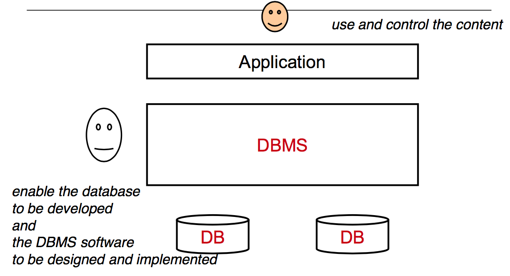

### Các khái niệm về Database

#### Database là gì?
Cơ sở dữ liệu (viết tắt CSDL; tiếng Anh là database) được hiểu theo cách định nghĩa kiểu kĩ thuật thì nó là một tập hợp thông tin có cấu trúc. Tuy nhiên, thuật ngữ này thường dùng trong công nghệ thông tin và nó thường được hiểu rõ hơn dưới dạng một tập hợp liên kết các dữ liệu, thường đủ lớn để lưu trên một thiết bị lưu trữ như đĩa hay băng. Dữ liệu này được duy trì dưới dạng một tập hợp các tập tin trong hệ điều hành hay được lưu trữ trong các hệ quản trị cơ sở dữ liệu.

Sau đây là một số ưu điểm mà CSDL mang lại:

– Giảm sự trùng lặp thông tin xuống mức thấp nhất. Do đó đảm bảo thông tin có tính nhất quán và toàn vẹn dữ liệu.

– Đảm bảo dữ liệu có thể được truy xuất theo nhiều cách khác nhau.

– Nhiều người có thể sử dụng một cơ sở dữ liệu

#### Database Management System - DBMS

Hệ quản trị cơ sở dữ liệu (tiếng Anh: Database Management System - DBMS), là phần mềm hay hệ thống được thiết kế để quản trị một cơ sở dữ liệu. Cụ thể, các chương trình thuộc loại này hỗ trợ khả năng lưu trữ, sửa chữa, xóa và tìm kiếm thông tin trong một cơ sở dữ liệu (CSDL). Có rất nhiều loại hệ quản trị CSDL khác nhau: từ phần mềm nhỏ chạy trên máy tính cá nhân cho đến những hệ quản trị phức tạp chạy trên một hoặc nhiều siêu máy tính.
Cơ sở dữ liệu được phân chia ra nhiều loại khác nhau:

Cơ sở dữ liệu dạng file: dữ liệu được lưu trữ dưới dạng các file có thể là text, ascii, *.dbf. Tiêu biểu cho cơ sở dữ liệu dạng file là*.mdb Foxpro

+ Cơ sở dữ liệu quan hệ: dữ liệu được lưu trữ trong các bảng dữ liệu gọi là các thực thể, giữa các thực thể này có mối liên hệ với nhau gọi là các quan hệ, mỗi quan hệ có các thuộc tính, trong đó có một thuộc tính là khóa chính. Các hệ quản trị hỗ trợ cơ sở dữ liệu quan hệ như: MS SQL server, Oracle, MySQL…

+ Cơ sở dữ liệu hướng đối tượng: dữ liệu cũng được lưu trữ trong các bảng dữ liệu nhưng các bảng có bổ sung thêm các tính năng hướng đối tượng như lưu trữ thêm các hành vi, nhằm thể hiện hành vi của đối tượng. Mỗi bảng xem như một lớp dữ liệu, một dòng dữ liệu trong bảng là một đối tượng. Các hệ quản trị có hỗ trợ cơ sở dữ liệu hướng đối tượng như: MS SQL server, Oracle, Postgres

+ Cơ sở dữ liệu bán cấu trúc: dữ liệu được lưu dưới dạng XML, với định dạng này thông tin mô tả về đối tượng thể hiện trong các tag. Đây là cơ sở dữ liệu có nhiều ưu điểm do lưu trữ được hầu hết các loại dữ liệu khác nhau nên cơ sở dữ liệu bán cấu trúc là hướng mới trong nghiên cứu và ứng dụng.