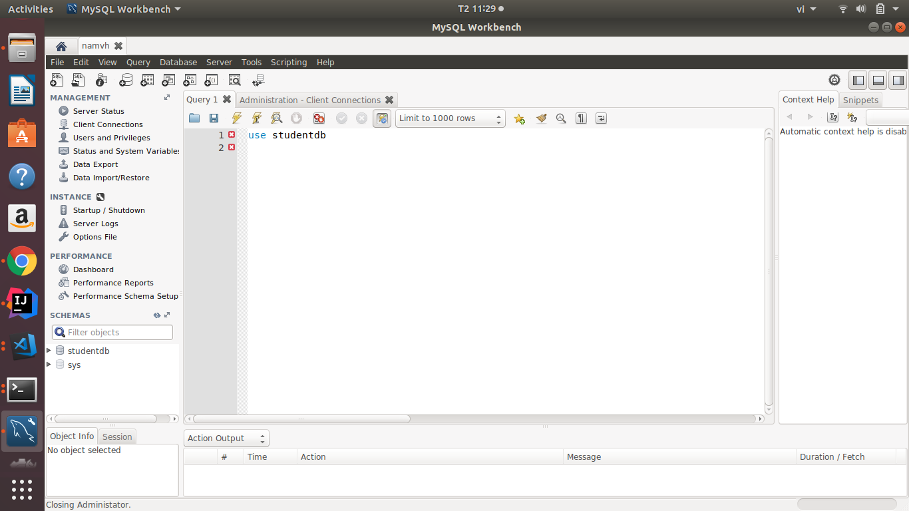

### MYSQL

#### 1. Định nghĩa

MySQL là một RDBMS nhanh và dễ dàng để sử dụng. MySQL đang được sử dụng cho nhiều công việc kinh doanh từ lớn tới nhỏ. MySQL được phát triển, được công bố, được hỗ trợ bởi MySQL AB, là một công ty của Thụy Điển. MySQL trở thành khá phổ biến vì nhiều lý do:

- MySQL là mã ngồn mở
- MySQL là một chương trình rất mạnh mẽ.
- MySQL sử dụng một Form chuẩn của ngôn ngữ dữ liệu nổi tiếng là SQL
- MySQL làm việc trên nhiều Hệ điều hành và với nhiều ngôn ngữ như PHP, PERL, C, C++, Java
- MySQL làm việc nhanh và khỏe ngay cả với các tập dữ liệu lớn
- MySQL rất thân thiện với PHP, một ngôn ngữ rất đáng giá để tìm hiểu để phát triển Web

### 1. Storage Engines 
Storage Engines là các thành phần mà xử lý các SQL operations cho các loại table khác nhau. InnoDB là mặc đinh trong MySQL.

Trong MySQL có 2 khái niệm locking khác nhau nhằm phục vụ mục đích transactional read/write: Table Lock & Row Lock
+ Table lock là lock được tạo ra để ngăn các transaction khác can thiệp vào 1 "table" được lock để tránh việc thay đổi dữ liệu trong quá trình 1 câu query đang được thực thi ở 1 table đó.

+ Row lock là lock được tạo ra để ngăn các transaction khác can thiệp vào "row" được lock để tránh việc thay đổi dữ liệu trong quá trình 1 câu query đang diễn ra.

##### 1.1 InnoDB
Đây là Storage Engine mặc định trong MySQL 5.7.
<b>Ưu điểm:</b>
+ (tuân thủ ACID) cho MySQL có các commit, rollback và khả năng khôi phục lỗi để bảo vệ dữ liệu người dùng.
+ Row-level locking của InnoDB và kiểu nonlocking read của Oracle-style làm tăng sự đồng thời và hiệu suất của nhiều người dùng.
+  InnoDB lưu trữ dữ liệu người dùng trong các clustered indexes để giảm I/O cho các truy vấn thông thường dựa trên các primary key. Để duy trì tính toàn vẹn của dữ liệu
+ InnoDB cũng hỗ trợ các ràng buộc toàn vẹn Foreign Key.

<b>Nhược điểm:</b>
+ Hoạt động cần nhiều RAM hơn
##### 1.2 MyISAM
Table-level locking giới hạn hiệu suất read/write dữ liệu, vì vậy nó thường được sử dụng cho các công việc read-only hoặc read-mostly trong các cấu hình Web và lưu trữ dữ liệu.
<b>Ưu điểm:</b>
+ Engine duy nhất hỗ trợ Full Text Search lập chỉ mục toàn văn, cung cấp thuật toán tìm kiếm khá giống Google.
+ Kiến trúc đơn giản nên có tốc độ truy suất (đọc và tìm kiếm) nhanh nhất trong các loại Storage Engine.

<b>Nhược điểm:</b>
+  hoạt động theo cơ chế Table Level Locking, nên khi có hành động thực hiện (thêm/sửa/xóa) 1 bản ghi nào đó trong table thì table đó sẽ bị khóa lại, chờ tới khi hành động này được thực hiện xong thì hành động kia mới tiếp tục được thực hiện. 
+  Kiến trúc đơn giản, không ràng buộc nên loại Storage Engine này rất dễ bị crash

##### 1.3 Memory
Lưu trữ tất cả dữ liệu trong RAM, để truy cập nhanh trong các môi trường đòi hỏi tra cứu nhanh các dữ liệu không quan trọng. Engine này trước đây gọi là HEAP Engine. Storage Engine này đang sử dụng ít dần, do InnoDB với vùng bộ đệm cung cấp một cách mục đích chung và bền để giữ hầu hết hoặc tất cả dữ liệu trong memory, và NDBCLUSTER cung cấp tra cứu giá trị quan trọng nhanh cho các bộ dữ liệu phân tán lớn.

<b>Ưu điểm:</b>
+ tốc độ truy xuất và cập nhật rất nhanh. 
+ Sử dụng làm bảng lưu trữ dữ liệu tạm thời

<b>Nhược điểm:</b>
+ Dễ mất dữ liệu khi mất điện, vấn đề phần cứng, khởi động lại MYSQL.
+ Kích thước bảng phụ thuộc vào cách cấu hình.
+ Chỉ dùng trong mục đích read-only

##### 1.4 CSV
Các bảng của nó thực sự là các tập tin văn bản với các giá trị được phân cách bởi dấu phẩy. Các bảng CSV cho phép bạn nhập hoặc đổ dữ liệu ở định dạng CSV, để trao đổi dữ liệu với các tập lệnh và ứng dụng đọc và ghi cùng một định dạng. Vì bảng CSV không được lập chỉ mục, bạn thường giữ dữ liệu trong các bảng InnoDB trong quá trình hoạt động bình thường và chỉ sử dụng các bảng CSV trong giai đoạn nhập hoặc xuất.

<b>Ưu điểm:</b>
+ Di động cao do dữ liệu lưu trên file

<b>Nhược điểm:</b>
+ Không hỗ trợ lập chỉ mục
+ Không hỗ trợ phân vùng
+ Dữ liệu trên các comlumn không được NOT NULL


##### 1.5 Archive
Các bảng nhỏ gọn, không biểu hiện này được dùng để lưu trữ và truy xuất số lượng lớn các thông tin kiểm tra lịch sử, lưu trữ, hoặc kiểm tra an toàn.

<b>Ưu điểm:</b>
+ Hỗ trợ insert, select, replace
+ Hỗ trợ auto_increment

<b>Nhược điểm:</b>
+ Không hỗ trợ delete, update.
+ Không đánh chỉ mục.

## 2. Installation
##### 2.1 Cài đặt MySQL server 5.7 trên Ubuntu
<b>Step 1: Step 1: Install MySQL</b>
```
$ sudo apt-get update
$ sudo apt-get install mysql-server
```

<b>Step 2: Verify the MySQL Installation</b>
```
$ dpkg --get-selections | grep mysql
mysql-client-5.7       install
mysql-client-core-5.7  install
mysql-common           install
mysql-server           install
mysql-server-5.7       install
mysql-server-core-5.7  install
```
<b>Step 3:  Start/Shutdown MySQL Server (mysqld)</b>

Đăng nhập vào system
```
mysql -u root -p
```
##### 2.2 Tạo Databases, tables

<b>Tạo một datase</b>
```
create database if not exists studentdb;
```

<b>Liệt kê database có sẵn trong một user</b>
```
show databases
```

<b>Ngoài cách sử dụng command để giao tiếp với MYSQL, sử dụng giao diện trực quan MYSQL WORKBENH</b>



<b>Sử dụng một database</b>
```
mysql> use studentdb;
```
<b>Tạo một table</b>
```
mysql> create table class101 (id int, name varchar(50), gpa float);
```
<b>Hiển thị các tables</b>
```
mysql>show tables;
+---------------------+
| Tables_in_studentdb |
+---------------------+
| class101            |
+---------------------+
```

<b>Xem mô tả một bảng</b>

```
mysql> describe class101;
+-------+-------------+------+-----+---------+-------+
| Field | Type        | Null | Key | Default | Extra |
+-------+-------------+------+-----+---------+-------+
| id    | int(11)     | YES  |     | NULL    |       |
| name  | varchar(50) | YES  |     | NULL    |       |
| gpa   | float       | YES  |     | NULL    |       |
+-------+-------------+------+-----+---------+-------+
```

<b>Insert vào một table</b>
```
insert into class101 values (22, 'Mohamed Ali', 4.9);
insert into class101 values (11, 'Tan Ah Teck', 4.8);
```

```
select * from class101;
+----+-------------+------+
| id | name        | gpa  |
+----+-------------+------+
| 11 | Tan Ah Teck |  4.8 |
| 22 | Mohamed Ali |  4.9 |
+----+-------------+------+
```

<b>Update một table</b>
```
update class101 set gpa = 4.4 where name = 'Tan Ah Teck';
```
```
select * from class101;
+----+-------------+------+
| id | name        | gpa  |
+----+-------------+------+
| 11 | Tan Ah Teck |  4.8 |
| 22 | Mohamed Ali |  4.9 |
+----+-------------+------+
```

## 3. Data type


## 4. Transaction
#### 4.1 Định nghĩa: 
Transaction là một tiến trình xử lý có xác định điểm đầu và điểm cuối, được chia nhỏ thành các operation (phép thực thi) , tiến trình được thực thi một cách tuần tự và độc lập các operation đó theo nguyên tắc hoặc tất cả đều thành công hoặc một operation thất bại thì toàn bộ tiến trình thất bại. Nếu việc thực thi một operation nào đó bị fail (hỏng) đồng nghĩa với việc dữ liệu phải rollback (trở lại) trạng thái ban đầu.

#### <b>ACID properties trong transaction</b>

<b>Atomicity :</b> mọi giao dịch chỉ thành công khi tất cả các phần thành công - All or Nothings.

<b>Consistency :</b> Đảm bảo tất cả các thao tác trên cơ sở dữ liệu được thay đổi sau khi giao dịch thành công và không xảy ra lỗi.

<b>Isolation :</b> các giao dịch thực thi một cách độc lập với nhau.

<b>Durability :</b> transaction cập nhật dữ liệu thành công (commit success) thì phải đảm bảo khi xảy ra sự cố database bị crash, restart lại hệ thống thì dữ liệu vẫn được giữ ở phiên bản mới nhất.

#### 4.2 Tại sao phải sử dụng transaction
Sử dụng transaction đảm bảo dữ liệu nhất quá.

### 4.3 Cách sử dụng transaction
<b>START TRANSACTION, COMMIT, and ROLLBACK Syntax</b>
```
START TRANSACTION
    [transaction_characteristic [, transaction_characteristic] ...]

transaction_characteristic: {
    WITH CONSISTENT SNAPSHOT
  | READ WRITE
  | READ ONLY
}

BEGIN [WORK]
COMMIT [WORK] [AND [NO] CHAIN] [[NO] RELEASE]
ROLLBACK [WORK] [AND [NO] CHAIN] [[NO] RELEASE]
SET autocommit = {0 | 1}
```

+ Bắt đầu một transaction `START TRANSACTION` or `BEGIN`.
+ `COMMIT` Lệnh COMMIT là lệnh điều khiển transaction được sử dụng để lưu các thay đổi đã được triệu hồi bởi một transaction tới Database.

+ `ROLLBACK` là lệnh điều khiển transaction được sử dụng để trao trả transaction về trạng thái trước khi có các thay đổi mà chưa được lưu tới Database.

+ `SET autocommit` thay đổi chế độ autocommit, mặc định trong MYSQL `autocommit` là enable, tức là khi thực hiện một transaction MYSQL sẽ lưu thay đổi mãi mãi và không thể  `ROLLBACL`.

Với `START TRANSACTION` autocommit là `disabled` tới cuối transaction với lệnh `COMMIT` hoặc `ROLLBACK`. sau đó `autocommit` sẽ được revert sang trạng thái trước đó.

Ví dụ với `COMMIT`:
```
START TRANSACTION;
Select * from class101;
UPDATE class101 SET gpa = gpa + 1.0 WHERE name = 'Mohamed Ali';
Select * from class101;
commit;
rollback;

```
Ví dụ với `ROLLBACK`
```
START TRANSACTION;
Select * from class101;
UPDATE class101 SET gpa = gpa + 1.0 WHERE name = 'Mohamed Ali';
rollback;
Select * from class101;
```
Trước transaction
```
+------+-------------+------+
| id   | name        | gpa  |
+------+-------------+------+
|   22 | Mohamed Ali |  8.9 |
| NULL | Peter Jones | 4.55 |
+------+-------------+------+

```
Sau khi thực hiện transaction
```
+------+-------------+------+
| id   | name        | gpa  |
+------+-------------+------+
|   22 | Mohamed Ali |  8.9 |
| NULL | Peter Jones | 4.55 |
+------+-------------+------+

```
<b>SAVEPOINT trong SQL</b>
Một SAVEPOINT là một điểm (point) trong một transaction khi bạn có thể lùi transaction về một điểm cụ thể mà không cần lùi transaction về trạng thái đầu trước khi có thay đổi đó.
```
SAVEPOINT TEN_CUA_SAVEPOINT;

ROLLBACK TO TEN_CUA_SAVEPOINT;
```

<b>RELEASE SAVEPOINT trong SQL</b>
Lệnh RELEASE SAVEPOINT được sử dụng để xóa một SAVEPOINT mà bạn đã tạo.
```
RELEASE SAVEPOINT TEN_CUA_SAVEPOINT;
```

<b>LOCK TABLES and UNLOCK TABLES Syntax</b>

một lock là một flag liên kết với bảng, MYSQL cho phép một phiên client nắm giữ một table lock và ngăn chặn các phiên khác truy cập vào một bảng.

<b>READ LOCK</b> 
+ một phiên làm việc với table chỉ có thể đọc không thể thay đổi trên table đó.
+ Nhiều session có thể đọc trên một table cùng lúc
```
lock table class101 read;
UPDATE class101 SET gpa = gpa + 1.0 WHERE name = 'Mohamed Ali';
```
lúc này lỗi sẽ xuất hiện do table bị read lock, mọi thay đổi trên bảng đều không thực thi.
```
Error Code: 1099. Table 'class101' was locked with a READ lock and can't be updated	0,00022 sec

```

<b>WRITE LOCK</b> 
+ một phiên làm việc giữ lock có thể read và write trên table.
+ Chỉ có một session thao tác với một table tại một thời điểm.

<b>UNLOCK TABLES</b>
Sử dụng UNLOCK TABLESunlock (mở khóa) bất kỳ bảng nào bị khóa ở session hiện tại.
```
lock table class101 read;
unlock tables;
UPDATE class101 SET gpa = gpa + 1.0 WHERE name = 'Mohamed Ali';
Select * from class101;
```
#### 5. Isolation

##### 5.1 Định nghĩa
Isolation level là một thuộc tính của transaction, qui định mức độ cô lập của dữ liệu mà transaction có thể truy nhập vào khi dữ liệu đó đang được cập bởi một transaction khác. Khi một transaction cập nhật dữ liệu đang diễn ra, một phần dữ liệu sẽ bị thay đổi (ví dụ một số bản ghi của bảng được sửa đổi hoặc bị xóa bỏ, một số được thêm mới), vậy các transaction hoặc truy vấn khác xảy ra đồng thời và cùng tác động vào các bản ghi đó sẽ diễn ra thế nào? Chúng sẽ phải đợi đến khi transaction đầu hoàn thành hay có thể thực hiện song song, kết quả dữ liệu nhận được là trong khi hay sau khi cập nhật? Bạn có thể điều khiển những hành vi này thông qua việc đặt isolation level của từng transaction. SQL Server cung cấp các mức isolation level sau xếp theo thứ tự tăng dần của mức độ cô lập của dữ liệu: Read Uncommitted, Read Commited, Repeatable Read, và Serializable. Từ bản 2005 bắt đầu bổ sung thêm một loại mới là Snapshot. Phần còn lại của bài này sẽ đi vào chi tiết của từng loại.

<b>Dirty reads</b> xảy ra khi transaction A tiến hành phép write với dữ liệu, transaction B tiến hành đọc dữ liệu sau khi A làm xong phép write. Tuy nhiên vì một lý do gì đó, transaction A không commit được, do đó sự thay đổi phép write không được chấp nhận, dữ liệu rollback lại trạng thái ban đầu, khi đó dữ liệu của B sẽ trở thành dirty – bẩn.

<b>Nonrepeatable reads</b> xảy ra khi transaction A tiến hành phép read trên dữ liệu, sau đó transaction B thực hiện phép write làm dữ liệu thay đổi, lần kế tiếp A lại tiến hành phép read với chính dữ liệu. Như vậy, 2 lần đọc của A thấy dữ liệu không nhất quán (consistency) trên cùng một bản ghi.

<b>Phantom reads</b> là rủi ro xảy ra với lệnh read có điều kiện (chẳng hạn mệnh đề where trong sql). Transaction A đọc được một số X dữ liệu thỏa mãn điều kiện 1, transaction B tiến hành phép write sinh ra một lượng Y dữ liệu thỏa mãn điều kiện , A tính toán lại với điều kiện 1 thấy bổ sung thêm một lượng Y dữ và tổng dữ liệu giữa 2 lần trở lên không đồng nhất.

##### 5.2 Read Uncommitted
Một transaction lấy dữ liệu từ một transaction khác ngay cả khi transaction đó chưa được commit. Xét ví dụ cụ thể như sau:

quert 1
```
START TRANSACTION;
    UPDATE `users` SET `point`= 100;
    SELECT SLEEP(30);
ROLLBACK;
```

query 1
```
SET TRANSACTION ISOLATION LEVEL READ UNCOMMITTED;
	SELECT * FROM `users`;
COMMIT;
```

Giả sử sau khi tiến hành câu Query 1 ta tiến hành chạy câu Query 2 thì kết quả trả về sẽ là 'point' = 100. Nhưng ngay sau khi câu Query 1 chạy xong và bị rollback thì kết quả trả về thực tế sẽ là là 'point' = 1. Như vậy transaction thứ 2 lấy kết quả chưa được commit của transaction thứ 1 => Hiện tượng trên gọi còn được gọi là <b>Dirty Read.</b> Ưu điểm ở đây là các transaction sẽ chạy liên tục và transaction sau ghi đè lên Transaction trước (Dirty Write).

##### 5.3 Read Committed
Đây là level default của một transaction nếu như chúng ta không config gì thêm. Tại level này thì Transaction sẽ không thể đọc dữ liệu từ từ một Transaction đang trong quá trình cập nhật hay sửa đổi mà phải đợi transacction đó hoàn tất. Như vậy thì chúng ta có thể tránh được Dirty Read và Dirty Write nhưng các Transaction sẽ phải chờ nhau => Perfoman hệ thống thấp. Ta thực hiện câu Query 1 như sau:

ví dụ:

query 1
```
START TRANSACTION;
    UPDATE `users` SET `point`= 100 WHERE 'id' > 0;
    SELECT SLEEP(30);
COMMIT;
```
query 2
```
SET TRANSACTION ISOLATION LEVEL READ COMMITTED
SELECT * FROM users
WHERE id>2
```
query 2 sẽ phải đợi cho đến khi query 1 thực hiện xong.

#### 5.4 Repeatable read
Giống như mức độ của Read Committed, tại mức độ này thì transaction còn không thể đọc / ghi đè dữ liệu từ một transaction đang tiến hành cập nhật trên bản ghi đó. Query 1:

query 1
```
START TRANSACTION;
    SELECT SLEEP(30);
    SELECT * FROM `users` WHERE `id` = 2;
COMMIT;
```
query 2
```
SET TRANSACTION ISOLATION LEVEL REPEATABLE READ;
    UPDATE `users` SET `point`= 100 WHERE 'id' = 2;
COMMIT;
```
#### 5.5 Serializable
Level cao nhất của Isolation, khi transaction tiến hành thực thi nó sẽ khóa các bản ghi liên quan và sẽ unlock cho tới khi rollback hoặc commit dữ liệu
query 1
```
SET TRANSACTION ISOLATION LEVEL SERIALIZABLE;
START TRANSACTION;
    SELECT * FROM `users`;
    SELECT SLEEP(30);
    SELECT * FROM `users`;
COMMIT;
```
query 2
```
 INSERT INTO `users` (`id`, `name`, `point`) VALUES ('3', 'Dat09', '3');
```


Mức isolation này đảm bảo các lệnh đọc trong cùng một transaction cho cùng kết quả, nói cách khác dữ liệu đang được đọc sẽ được bảo vệ khỏi cập nhật bởi các transaction khác. Tuy nhiên nó không bảo vệ được dữ liệu khỏi insert hoặc delete:

#### 6. Connector

#### 6.1 Sử dụng JDBC
JDBC (Java Database Connectivity) là một API tiêu chuẩn dùng để tương tác với các loại cơ sở dữ liệu quan hệ. JDBC có một tập hợp các class và các Interface dùng cho ứng dụng Java có thể nói chuyện với các cơ sở dữ liệu.

<b>DriverManager </b>:
Là một class, nó dùng để quản lý danh sách các Driver (database drivers). 
<b>Driver </b>:
Là một Interface, nó dùng để liên kết các liên lạc với cơ sở dữ liệu, điều khiển các liên lạc với database. Một khi Driver được tải lên, lập trình viên không cần phải gọi nó một cách cụ thể.
<b>Connection </b>:
Là một Interface với tất cả các method cho việc liên lạc với database. Nó mô tả nội dung liên lạc. tất cả các thông tin liên lạc với cơ sở dữ liệu là thông qua chỉ có đối tượng Connection.
<b>Statement </b>:
Là một Interface, gói gọn một câu lệnh SQL gửi tới cơ sở dữ liệu được phân tích, tổng hợp, lập kế hoạch và thực hiện.
<b>ResultSet </b>:
ResultSet đại diện cho tập hợp các bản ghi lấy do thực hiện truy vấn.