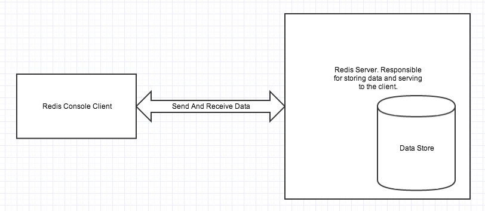

### Redis
#### 1. Khái niệm
Redis là 1 hệ thống lưu trữ key-value rất mạnh mẽ và phổ biến hiện nay. Redis nổi bật bởi việc hỗ trợ nhiều cấu trúc dữ liệu cơ bản(hash, list, set, sorted set, string), giúp việc thao tác với dữ liệu tốt hơn các hệ thống cũ như memcached rất nhiều.
Key-Value store là một hệ thống lưu trữ mà ở đó dữ liệu được lưu dưới dạng cặp key-value. Các cặp key-value sẽ được lưu ở trong Ram. Nhờ đó tốc độ truy suất sẽ cực kì nhanh.

Ưu điểm: 
+ Tốc độ truy suất cực kì nhanh

Nhược điểm: 
+ Kích thước Ram có hạn do đó không thể lưu trữ dữ liệu lớn.

#### 2. Các phiên bản của redis

+ Unstable: là phiên bản cho nhà phát triển, sử dụng 
kiểm tra các tính năng mới nhất hoặc cải thiện hiệu suất.

+ Stable: bản ổn định được hỗ trợ với cộng đồng lớn. Phiên bản hiện tại là 5.0

+ Docker: phiên bản dành cho Docker.

#### 3. Kiến trúc của Redis

+ Redis client và redis server có thể ở cùng một máy hoặc trên hai máy 

+ Redis server chịu trách nhiệm lưu trữ dữ liệu trong memory.

+ Redis client có thể là redis client consose hoặc các redis API hỗ trỡ cho các ngôn ngữ lập trình.

+ Việc lưu trữ dữ liệu trên Ram có thể dẫn đến việc mất dữ liệu khi mất điện hoặc sập nguồn, Vì vậy cần một cách nào đó để khắc phục vấn đề này, gọi là Redis Persistance

Bên cạnh việc lưu key-value trên bộ nhớ RAM, Redis có 2 background threads chuyên làm nhiệm vụ định kỳ ghi dữ liệu lên đĩa cứng.

Có 2 loại file được ghi xuống đĩa cứng:

+ RDB
+ AOF

RDB lưu dữ liệu dưới dạng đã mã hóa. AOF lưu lại toàn bộ dưới liệu dưới dạng command, giống như command mà redis client gửi đến server để thao tác bằng cách ghi đè xuống cuối file.

File rdb có thể coi là một snapshot của cơ sở dữ liệu tại một thời điểm nhất định. File dữ liệu này được dùng với 2 mục đích

+ Cho phép redis có thể phục hồi lại dữ liệu trên memory bằng việc đọc file
+ Bản thân dữ liệu được ghi ra file rdb sẽ được gửi đến các redis slave server, phục vụ mục đích sao lưu server.

Với AOF file, các command sẽ được nhóm thành các block. Các block được tổ chức dưới dạng danh sách liên kết. Mỗi block có độ lớn 10MB là vì trong trường hợp redis server chịu tải cao, số lượng key được cập nhật lớn, nếu kích thước buffer lớn, việc realloc buffer dùng cho các command với tốc độ lớn không đảm bảo.

#### 4. Datatype

#### 5. Pub/Sub

PUB: PUBLISH (Đẩy dữ liệu vào 1 kênh)

SUB:  SUBSCRIBE (Đăng kí vào 1 kênh)

Ta thực hiện việc đặt người dùng(SUB) vào 1 kênh (ở đây kênh này là số bản tin mới). Thì khi có một bản tin được thêm vào hệ thống Redis sẽ tự động phát sinh sự kiện (PUB), sự kiện(PUB) này chúng ta có thể bắt được nhờ vào Redis cung cấp, ta thực hiện xử lý số liệu để cập nhật cho người dùng

rediscommand

`redis-cli ` : Khởi chạy redis client

`PSUBSCRIBE pattern [pattern ...]`
Subscribes to channels matching the given patterns.

`PUBLISH channel message`
Posts a message to a channel.

`SUBSCRIBE channel [channel ...]`
Listens for messages published to the given channels.

`UNSUBSCRIBE [channel [channel ...]]`
Stops listening for messages posted to the given channels.

Ví dụ :

#### 6. Lock

<b>Lock</b>
Lock là một kỹ thuật đồng bộ nhằm giới hạn số lượng truy cập vào một tài nguyên trong một chương trình tại một thời điểm.

Trong cơ sở dữ liệu locking là một cơ chế RDBMS ngăn chặn người dùng từ nhiều transactions khác nhau gây ra data conflicts. Locking một row giúp ngăn chặn các transactions khác thay đổi row đó cho đến khi transaction đang truy cập vào nó kết thúc. Trong đó có 2 chiến lược lock là: optimistic và pesimistic. Trong bài post này, tôi sẽ giải thích sự khác nhau giữa pessimistic và optimistic locking đối với context của ADF framework.

<b>Pessimistic locking và Optimistic locking</b>

Pessimistic locking: là cơ chế  hoạt động bằng cách lock một row trước khi một attribute của nó được thay đổi thông qua việc gọi đến method setAttribute(). Nếu có bất kì transaction khác cố gắng truy cập vào row đã bị khóa đó, chúng sẽ bị buộc phải chờ cho đến khi transaction đầu tiên hoàn thành.

<b>Optimistic Locking</b>

Với Optimistic lock nhiều người dùng có thể cùng truy cập đến đối tượng và đọc dữ liệu từ nó. 
Optimistic Locking cho phép nhiều giao dịch có thể hoàn thành mà không ảnh hưởng đến nhau. 

<b>Distributed locks</b> 
Distributed locks là kĩ thuật hữu ích trong hệ phân tán mà có nhiều process sử dụng chung tài nguyên dùng chung.

Trong redis có hỗ trợ Redlock, đảm bảo distributed lock theo một số  cách khác nhau.

+ Safety property: loại trừ lẫn nhau, tại một thời điểm, chỉ có một client giữ được lock.
+ Liveness property A: giải phóng deadlck, cuối cùng thì một tài nguyên sẽ giải phóng nếu client giữ lock bị crash.
+ Liveness property B: chịu lỗi, Cho dù có nhiều node được thêm vào, thì các clients vẫn có thể lấy được lock. 